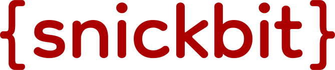

<br />
<div style="text-align: center;">
	<a href="https://github.com/snickbit/snickbit">
		
</a>

<h1 style="margin: 0">Nick Lowe</h1>
<h3 style="margin: 0">Full-Stack Web Developer</h3>
</div>

<div style="text-align:center;padding-top: 24px;">

[![website][website-shield]][website-url]
[![LinkedIn][linkedin-shield]][linkedin-url]
[![repos][repos-shield]][repos-url]

</div>

## Usage

### Terminal

Just run the command below to start my npx business card.

```bash
npx snickbit
```

### Programmatically

```bash
pnpm add @snickbit/snickbit
```

```bash
yarn add @snickbit/snickbit
```

```bash
npm install @snickbit/snickbit
```

 ```js
import {Snickbit} from 'snickbit';

const snickbit = new Snickbit();

snickbit.addProject({
	name: 'Snickbit.com',
	description: 'My personal website built with Quasar (vue.js), Feathers.js, and MongoDB.',
	url: 'https://snickbit.com'
})

snickbit.addProject({
	name: `Arbiter's Aide`,
	description: 'Laravel & Vue SPA web app for organizing Table Top RPG campaigns like Dungeons & Dragons. Uses Socket.io & Redis for real-time updates.',
	url: 'https://arbitersaide.com'
})

snickbit.addProject({
	name: 'IsThisDubbed?',
	description: 'Single-serving website built with Laravel. Uses multiple APIs, web scraping, and community moderation for data and corrections',
	url: 'https://isthisdubbed.com'
})

snickbit.writeCode('snickbit.com').then(() => {
	console.log('Hooray, you did something today!')
}).catch(err => {
	console.error('So there were some bugs, it happens.', err)
})
 ```

## Documentation

### [API Docs](https://github.com/snickbit/snickbit/blob/main/docs/README.md)

## License

Copyright (c) 2022 - **Nicholas Lowe** aka **Snickbit**

[MIT License](https://github.com/snickbit/snickbit/blob/main/LICENSE)

[version-shield]: https://img.shields.io/badge/version-30.9.0-%23A90000?style=for-the-badge

[website-shield]: https://img.shields.io/badge/%7Bsn%7D-snickbit.com-%23555555?style=for-the-badge&labelColor=%23A90000

[website-url]: https://snickbit.com

[repos-shield]: https://img.shields.io/badge/dynamic/json?color=%23A90000&label=Public%20Repos&query=%24.public_repos&url=https%3A%2F%2Fapi.github.com%2Fusers%2Fsnickbit&style=for-the-badge

[repos-url]: https://github.com/snickbit?tab=repositories&type=source

[linkedin-shield]: https://img.shields.io/badge/-LinkedIn-black.svg?style=for-the-badge&logo=linkedin&colorB=555

[linkedin-url]: https://linkedin.com/in/snickbit

